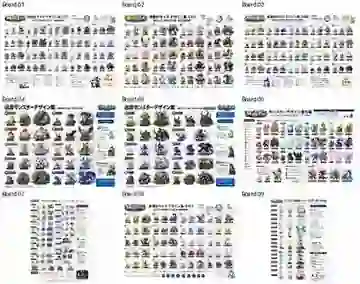
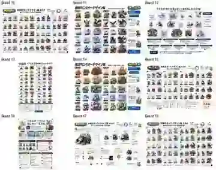
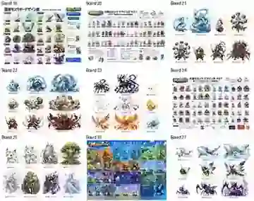
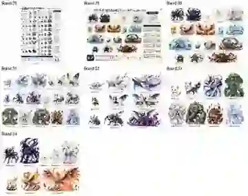
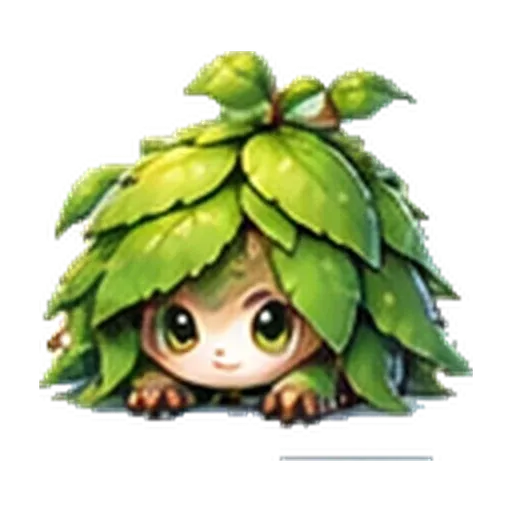
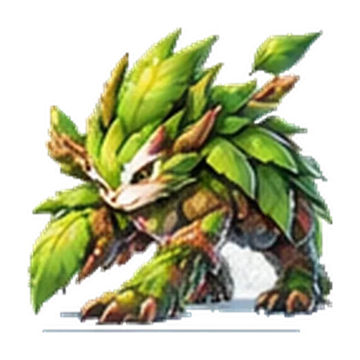
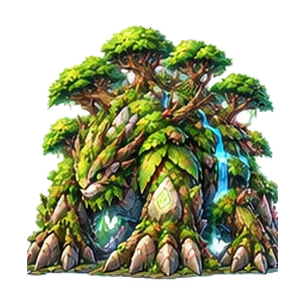

# W-303 Grass — User Review Comparison Board

Status: **USER REVIEW GATE / BEFORE NEW CANDIDATE GENERATION**  
Attribute: `grass`  
Representative families: F001, F028, F029

## Important

This environment has **no image-generation capability**. Therefore there is **no fabricated “new candidate” image** in this board.

The board intentionally compares:

- GitHub-ingested 0822 historical reference;
- existing CURRENT candidate where one exists;
- the new production-ready generation packet direction;
- Stage 1 → middle → final progression;
- KEEP / REFINE / REGENERATE judgment;
- change reason.

**Do not mass-generate the remaining grass families from one visual formula before this direction is reviewed.**

## 0822 historical pack — visual reference only

W-302 contact sheets are shown as the reference library. Historical labels/numbers do not override CURRENT.

<table>
<tr>
<td> contact-01 / boards 01-09</td>
<td> contact-02 / boards 10-18</td>
</tr>
<tr>
<td> contact-03 / boards 19-27</td>
<td> contact-04 / boards 28-34</td>
</tr>
</table>

Useful 0822 visual-language cues retained by W-303:

- clear Stage 1 → middle → final mass/silhouette growth;
- readable full-body presentation;
- local color and material differences rather than aura-only typing;
- strong final-form presence.

Historical warning cues explicitly rejected:

- repeated quadruped / pointed-ear / horn / wing formulas across unrelated families;
- “same body + green recolor/aura” treatment;
- micro-detail or effect density that disappears at game size;
- final-stage convergence into dragon, humanoid or heavy armor without CURRENT support.

Because W-302 provides pack-level availability rather than a canonical board-to-species map, W-303 does not falsely claim that any historical figure is a specific CURRENT monster solely from an old label.

---

# Representative comparison A — F001

## CURRENT family

`m001 モコハ → m002 ワカバネ → m003 ジュランガ`  
Motif: **葉と若木**  
Arc: hides under a leaf → fights with the leaf → becomes an immovable protector / forest wall.

## Existing CURRENT candidates

<table>
<tr>
<td align="center"> <b>m001 モコハ / S1</b></td>
<td align="center"> <b>m002 ワカバネ / S2</b></td>
<td align="center"> <b>m003 ジュランガ / S3</b></td>
</tr>
</table>

## Judgment

**REFINE** — preserve the existing leaf/young-tree identity and family lineage. Do not restart from zero.

## New candidate target

**No image generated in this environment.** Use `GP-F001` in `W-303-GRASS-ATTRIBUTE-REVIEW.md`.

| Stage | Identity to preserve | Change target |
|---|---|---|
| m001 / S1 | dominant leaf, shy/hiding read | keep compact and low; avoid generic permanently-smiling mascot face |
| m002 / S2 | same face/color family, leaf feature | clearly open the posture and make the leaf function as a weapon; middle must be more than size/recolor |
| m003 / S3 | leaf/tree identity, protector role | make final **broad, rooted, defensive and heavy**; power comes from body/tree mass rather than leaf-particle aura |

### Why change

W-301 already judged F001 as REFINE after direct CURRENT + 0822 calibration. The main correction is to prevent the final from reading as another agile leafy animal and to make the “動かない森の壁” role visually decisive.

### Anti-duplication target

F001 owns **horizontal defensive tree mass**. It must not reuse F046's vertical habitat-tree silhouette or F080's world-tree axis.

---

# Representative comparison B — F028

## CURRENT family

`m082 ツルリン → m083 ジャングリ → m084 ミドリヴァイン`  
Motif: **つると密林**  
Arc: hangs from high places → uses vines for fast movement/whip action → becomes the forest path and guides others.

## Existing CURRENT candidate

**None.** W-302 queue contains no CURRENT per-ID candidate for F028.

## Judgment

**REGENERATE** — required by the style lock because no CURRENT per-ID asset exists. Historical 0822 identity must still be used when a compatible vine/silhouette/palette match is found.

## New candidate target

**No image generated in this environment.** Use `GP-F028`.

| Stage | Planned silhouette | Signature growth |
|---|---|---|
| m082 / S1 | small center body + one long hanging vine loop | one unmistakable loop / hanging read |
| m083 / S2 | diagonal S-curve, fast and active | same vine becomes a purposeful whip / motion line |
| m084 / S3 | large open arch / path-shaped negative space | vine loop develops into guiding path/arch rather than becoming a bulky tree |

### Why this direction

Grass already has three tree-adjacent families. A long hanging/arching line gives F028 an entirely different small-size silhouette and directly expresses its CURRENT “高いところ / 森の道” concept without adding wings, horns, armor or green aura.

### Anti-duplication target

F028 owns **line and negative space**. Do not give it F001/F046/F080 tree mass, F014's compact root body or F029's radial flower crown.

---

# Representative comparison C — F029

## CURRENT family

`m085 サボテニョ → m086 ハナトゲ → m087 カクタリア`  
Motif: **サボテンと花**  
Arc: thorny/unapproachable → thorns soften and a bud develops → blooms the most beautiful flower / “さばくの おひめさま”.

## Existing CURRENT candidate

**None.** W-302 queue contains no CURRENT per-ID candidate for F029.

## Judgment

**REGENERATE** — required because there is no CURRENT per-ID candidate. Preserve a clearly compatible historical cactus/flower hue or bloom progression if one is matched in 0822; do not inherit an unrelated creature template.

## New candidate target

**No image generated in this environment.** Use `GP-F029`.

| Stage | Planned silhouette | Signature growth |
|---|---|---|
| m085 / S1 | short rounded succulent / cactus mass | clear thorn clusters, simplified enough for game size |
| m086 / S2 | slightly taller and asymmetric | thorn density relaxes; a single bud breaks the silhouette |
| m087 / S3 | low succulent base + large radial bloom | flower becomes dominant while cactus identity remains obvious |

### Why this direction

The final must feel elegant and impressive without converting “おひめさま” into a human princess, dress or armor. The cactus body, thorn rhythm and one concentrated bloom create identity from anatomy/material rather than generic grass effects.

### Anti-duplication target

F029 owns **succulent column + radial bloom**. Flower color alone is not allowed to differentiate it from F014; F014 remains root/walking/spring-driven.

---

# What the user is reviewing at this gate

| Review question | F001 | F028 | F029 |
|---|---|---|---|
| Does the family preserve CURRENT identity? | leaf/young tree + protector | vine/high-place/path guide | cactus/thorn/bloom |
| Is stage progression structural? | hide → fight → rooted wall | hanging loop → S-curve → arch/path | thorny compact → bud → radial bloom |
| Is it distinct from other grass families? | horizontal defensive mass | open-line / negative space | succulent + flower radial mass |
| Historical work discarded without reason? | **No** — current candidate retained as REFINE base | **No** — compatible 0822 cues must be carried into generation | **No** — compatible 0822 color/bloom cues must be carried into generation |
| New candidate shown? | **No — image generation unavailable** | **No — image generation unavailable** | **No — image generation unavailable** |

## Gate state

- Review board: **READY**
- Generation packets for all 6 grass families: **READY**
- New candidate generation: **NOT PERFORMED**
- Candidate ingestion: **NOT PERFORMED**
- FORMAL promotion: **NOT PERFORMED**
- Mass-generation direction: **HELD FOR USER VISUAL-DIRECTION REVIEW**

This gate is intentionally before new grass candidate production, as required.
